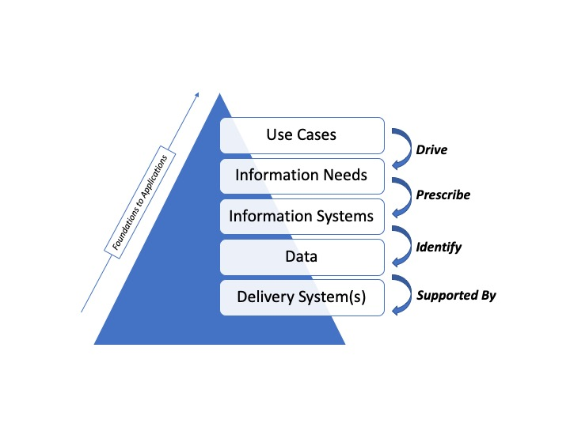

# Cloud-Tool-Architecture

## Problem statement

Demostrate the collaboration opportunies provided by deploying CD2H applications in the NCATS cloud.   

## Project description
Define and document a cloud deployment workflow that can be used by all CD2H sites to guide deploying applications and tools in the NCATS cloud. 
We will deploy a CD2H branded GitLab instance in the CD2H cloud.  This has a dual benefit, first we will use the creation of the NCATS-CD2H GitLab as a working/learning experience that directly feeds information into creating the deployment workflow mentioned prior.   Second, the cloud based GitLab will provide a location for other CD2H sites to create repositories.    Both AWS and Docker GitLab instances are planned.
In addition we will deploy the Mortality Prediction app code and documentation into the CD2H Gitlab. A Docker container will also be created as a sandbox environment for the Mortality Prediction app. Lessons learned in the Mortality Prediction deployment will be used to enhance the deployment workflow. 
Deployment of an NLP application into the NCATS cloud using the documented deployment workflow is also planned as part of this project. 

 

## Contact person

We require a contact person for each project for administrative purposes. Each project should also have a CD2H Program director assigned.

Point person (github handle) | Site | Program Director
----------|--------------|---------------
Tom Dillon (@tmdillon) | Washington University I2 | Melissa Haendel

## Leads 

Lead(s) (github handle) | Site
----------|--------------|
Justin Guinney, Director and EHR Challenge Project Lead (Sage Bionetworks)
Philip Payne, Co-Director and Cloud Architecture Project Lead (Wash U)

## Distro List
For project email addresses, please see bit.ly/cd2h-people-slim

## Team members 

Washington University I2: 
-	Philip Payne
-	Tom Dillon
-	Ricky Rodriguez
-	Albert Lai
-	TBN Cloud Architect

Sage:
-	Justin Guinney
-	James Eddy

NCATS:
-	Ken Gersing
-	Usman Sheikh
-	Kirsch, Keats (NIH/NCATS)
   

## Repositories
https://github.com/data2health/Cloud-Tool-Archtecture

## Approach

Cloud-Tool-Architecture Project: 

Our approach to the design and delivery of an elastic, scalable, and sustainable common cloud architecture for use by the national CTSA network will be based upon the NIST Enterprise Architecture Model (GAO, 2010: “A Framework for Assessing and Improving Enterprise Architecture Management”).  The NIST Enterprise Architecture Model (EA) incorporated 5 interdependent layers of architectural planning and implementation, as is shown in Figure 1 below, spanning a spectrum from technical foundations to end-user defined use cases.

 
 
Figure 1:  Overview of NIST EA model, showing five interdependent layers of architectural planning and implementation.
Given this model, we will pursue an iterative process of architecture design, implementation, verification/validation, and deployment, working in close coordination with all CD2H cores and projects, as well as a cross-section of CTSA informatics community members from throughout the national network.  In doing so, we will take a use case driven approach, in which the ensuing architecture will be optimized to ensure the successful satisfaction of end-user information needs.  Further, these activities will be interwoven with the architectural and planning activities being undertaken by the Resource Discovery and Development (RDD) Core, Next Generation Data Sharding (NGDS) Core, and the information technology team at NCATS (NCTAS-IT).  A RACI model demonstrating these interdependencies as shown in Table 1 below.  It is important to note that we anticipate some changes to this RACI model as we accrue project experience, various projects mature or are completed, and our collective teams establish standard operating procedures, and as such, it should be considered an “organic” framework that will evolve over time.

Table 1:  Coordination of architectural design processes spanning CD2H and NCATS units (Key: R = Responsible, A = Accountable, C = Consulted, I = Informed)

| Design Layer  | TCA | RDR | NGDS | NCATS-IT | 
| ------------- | ------------- | ------------- | ------------- | ------------- |
| Use Cases  | R,A | R | C | I | 
| Information Needs  | R  |  R,A | C | I | 
| Information Systems  | R,A  |  C | C | I | 
| Data  | C  |  C | R,A | I | 
| Delivery Systems | C  |  C | C | R,A |  

  
## Deliverables

Building on the preceding research design, during the forthcoming performance period (spanning 6 months), we intend to execute upon the following tasks:
1.	We will deploy a CD2H instance of the GitLab platform, leveraging NCATS cloud resources.  This platform will provide a common environment for the development, documentation, and sharing of software artifacts, as well as core capabilities for continuous integration and deployment (CI/CD) as will be needed for future tasks related to establishing shared software quality “benchmarks”;
2.	We will integrate the aforementioned CD2H GitLab platform with one or more common authentication and authorization services supported by NIH/NCATS, in order to simplify community-member access and use of said environment;
3.	We will develop a set of technology deployment processes and documentation standards, working across the CD2H and NCATS teams, as are needed to support tasks 1 and 2, while informing future and analogous technology deployment activities; and
4.	In parallel, and working in coordination with the teams responsible for Projects 3 and 4, we will demonstrate the use of containerization technologies to enable the rapid “packaging” and deployment of such applications in the NCATS cloud environment, using either a SaaS and/or Virtual Server model.
In order to ensure the sustainability of our methodology and its associated technical deliverables (including software components, best practices, etc.), we will couple all project related efforts with a continuous program of documentation and version management.  Such activities will ensure that other cores, sites, or organizations could assume responsibility for the ongoing adoption or use of all research products described in this proposal.  Specific measures to be taken in this regard include:
•	Organization of all software development into discrete versions or releases that will be formalized, “checked-in” to the project’s GitHub/Lab site, and fully documented using community-accepted best practices;
•	Documentation of all project-related design processes, decisions, use cases, and evaluation metrics;
•	Use of software engineering best practices, in-line documentation, and quality assurance mechanisms; and
•	Consistent use of open-source and standards-based software technologies and architectures.

## Milestones

The milestones for this project is here:

https://github.com/data2health/Cloud-Tool-Archtecture/milestones

## Evaluation

We will evaluate the outcome of this project in the following ways:

- A Git repository solution was identified and will be available for use by CD2H teams deploying to the NCATS cloud.
- The Motality-Predition application was sucesfully deployed as a docker/container to the NCATS cloud.
- An NLP application was sucesfully deployed as a docker/container to the NCATS cloud.
- A guidebook/workflow was documented that other CD2H teams can use to deploy applications to the NCATS cloud.

## Education

Project 1- Cloud Architecture: Development and Publication of Technical Best Practices and Standards

In a manner analogous to the aforementioned outreach, engagement, and educational activities, the cloud architecture team at WashU will also engage in a process of iterative development and publication of technical best practices and standards related to the quality, documentation, and development lifecycle management of software products intended for deployment in the NCATS cloud environment. These documents and standards will be generated concomitant with the technical deliverables and tasks associated with this Project as well as Projects 3 and 4, so as to be anchored in those practical deployment activities. Specific frameworks to be used to inform the generation of these documents and standards will include (but are not limited to):

•	ISO/IEC/IEEE 15289 (2017): Systems and software engineering – content of life-cycle information products (documentation). This standard specifies a minimum information content for software documentation from several perspectives: o	Purpose and common content for typical information items (generic types) o	Specific content needed for various life-cycle processes o	Types of data collected and used •	ISO/IEC 26513 (2009): Systems and software engineering - requirements for testers. This standard focuses on the development of systematized plans for software testing throughout the development lifecycle. The standard specifies the documentation need for verification and validation at the unit level, as well as processes for managing the output of reviews, and resolving problems discovered during reviews and tests.

These documents will be made available in a curated manner via the Guidebook, but also in a dynamic manner via the CD2H Git Repository. Further, they will be subject to comment, feedback, and stakeholder approval via the “Tools of the Trade” sessions described in the outreach, engagement, and educational plan.

This information is also in the Education Plan File (education.md)

## Get involved

Project 1- Cloud Architecture: Outreach, Engagement, and Education Plan

For the purposes of the interaction between Project 1 (cloud architecture) and Projects 3 and 4 (pilot deployment of “cloudified” applications), we will implement a multi-part outreach, engagement, and education plan, consisting of the following activities:

•	The cloud architecture team at WashU will conduct regularly scheduled and virtual “technical stand up meetings” with the teams developing and providing access to the applications to be “cloudified”; •	The project manager at WashU will generate a shared project charter for each “cloudification” effort, outlining: 1) project objectives; 2) technical deliverables; 3) timelines; 3) communications plans (beyond the preceding “technical stand up meeting”); and 4) risk management plans. These charters will be considered “living” documents (hosted in the CD2H Git Repository) and updated on a regular basis to reflect project milestones, achievements, and other relevant developments. •	During the course of the “cloudification” projects, we will also generate and regularly update a set of technical best practice documents and associated workflow and RACI models, focusing on the technology deployment process for both Virtual Server and SaaS solutions that are being containerized and deployed in the NCATS cloud environment. These documents will be made available in a curated manner via the Guidebook, but also in a dynamic manner via the CD2H Git Repository. •	On a regularly occurring basis (at least bi-monthly, and more frequently based upon demand), the cloud architecture team at WashU will host a cloud deployment “tools of the trade” webinar, which will be open to all CTSA hubs, and which will highlight recent activities of the team as well as the aforementioned technical best practice documents and findings. Similarly, a slack channel for CTSA hub affiliates interested or engaged in cloud architecture and deployment will be established to enable asynchronous communication in-between such webinars. •	Finally, the cloud architecture team at WashU will engage in regular environmental scanning of the IDTF and broader CTSA community to identify future opportunities for “cloudification” projects. Simultaneously, the team will also engage in broader scanning to identify and report back to interested individuals (via the above mechanisms) on emergent cloud computing and architectural models and frameworks that may impact the work of the CD2H and broader CTSA communities.

This information is also in the Engagement plan file (engagement.md)

## Working documents
Documentation may be natively in GitHub using the wiki or .md files in the appropriate folder, or in Google Drive.
[Documentating projects in Github](https://guides.github.com/features/wikis/)

[The project Google drive folder](https://drive.google.com/drive/u/0/folders/1vLp-H32KTNobiZF2cK82At90S6dVJNUf) is accessible to onboarded participants. 

## Slack room
[The project slack room](https://cd2h.slack.com/messages/CEY05KLPM/) is accessible to onboarded participants. You will not automatically be added to Slack, please join via the link above.

## Need help with GitHub? See the Managing Tranlational Informatics Projects (MTIP) tutorial

This [tutorial](https://data2health.github.io/mtip-tutorial/lessons/Lesson5.html) covers markdown basics and more.
